# vota_dolores_hidalgo

## Ronda 1 Registrar un voto valido

### Prueba que falle

### Prueba que salga bien 

--------

## RONDA 2 — Rechazar votos a opciones que no existen

### Prueba en la que falla 

### prueba en la que sale bien

---
## RONDA 3 — Un usuario no puede votar dos veces

### Prueba en la que fallá

###  Prueba en la que sale bien 

---
## RONDA 4 — Calcular resultados con porcentajes

### Escribiendo una que falle 

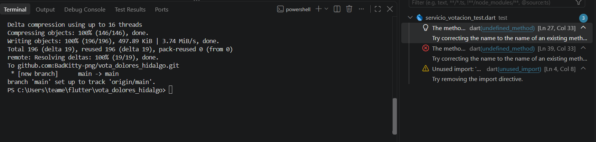

### Escriebiendo correctamente

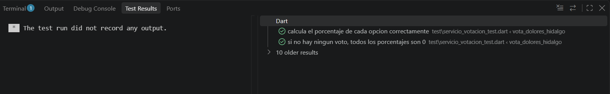

---
## RONDA 5 — Determinar el ganador

### ROJO — Escribe una prueba que falle
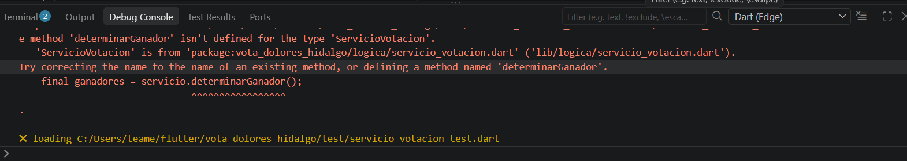

### VERDE — El mínimo código para pasar

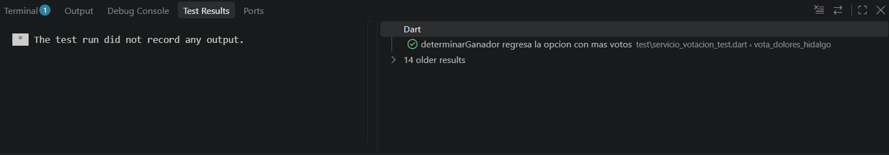

---

## RONDA 6 — Reconocer un empate (no elegir al azar)

###  ROJO — Escribe una prueba que falle

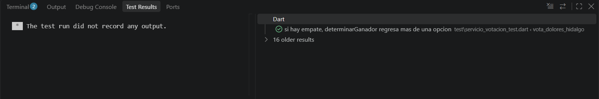

###  VERDE — Escribe una prueba salga bien

Aquí como dice el documento todo pasa en verde 
---
## RONDA 7 — No se puede votar después del cierre
### 🔴  ROJO — Escribe una prueba que falle

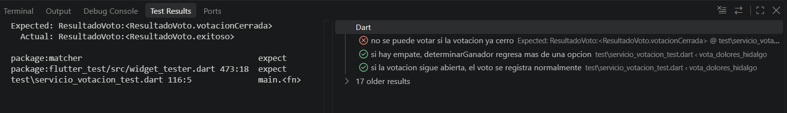

### 🟢  VERDE — El mínimo código para pasar

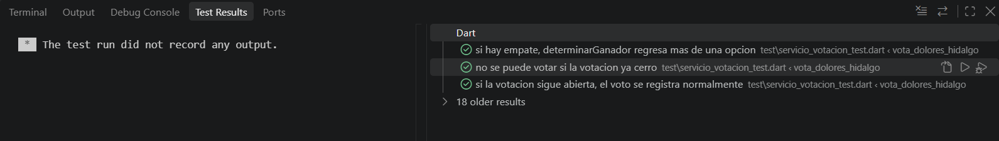

---
## RONDA 8 — Refactor final: guard clauses más legibles

### 🔵  REFACTOR — Mejora el código sin romper nada
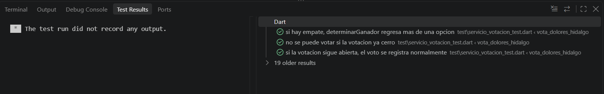

# 4. Prueba de Integracion: un plebiscito completo 

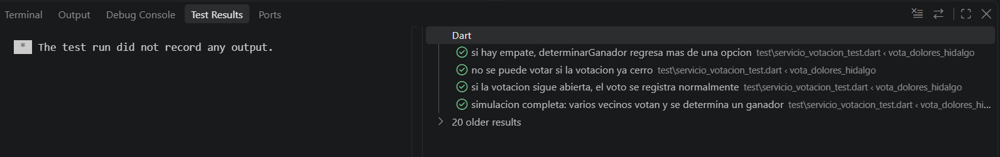

# 5. La interfaz gráfica animada

Ejecuto correctamente todos los comandos de esta zona
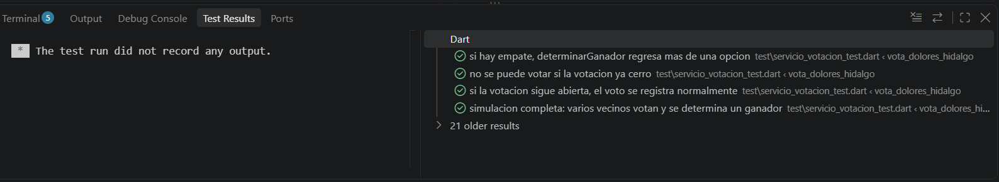

# 6. Cómo ejecutar todo
 Paso todas las pruebas

Ejecucion del flutter
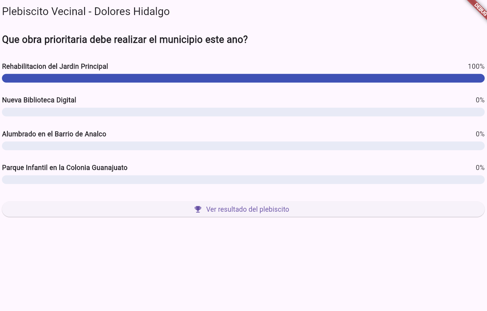

Barra: 
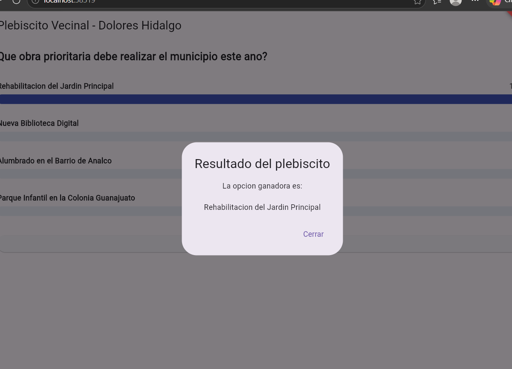